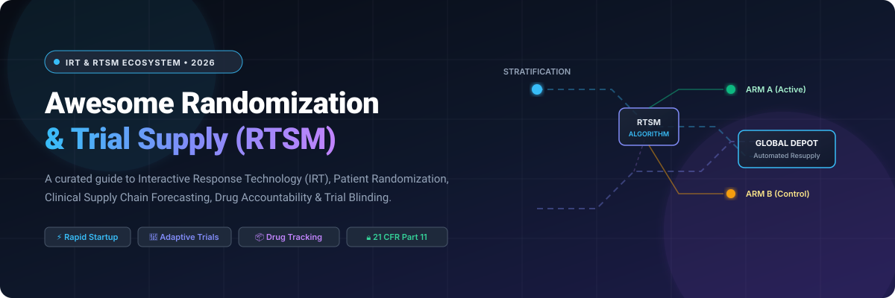

# 💊 Awesome Randomization & Trial Supply (RTSM / IRT) 📦

  

  
  
  
  
  
  
  

---

## 🧭 Curated Guide to RTSM, IRT, Clinical Supply Logistics & Biostatistical Randomization

> **Interactive Response Technology (IRT)** and **Randomization and Trial Supply Management (RTSM)** systems serve as the operational backbone of interventional clinical trials. They enforce protocol treatment allocation, dynamically manage investigational medicinal product (IMP) inventory across international depots and clinical trial sites, automate patient dispensing, safeguard study blinding, and ensure full audit compliance under **FDA 21 CFR Part 11**, **EU Annex 11**, and **ICH GCP E6(R2)**.

This repository tracks premier **commercial SaaS platforms** and validated **open-source libraries** spanning:
- 🎲 **Patient Randomization Algorithms** (Simple, Permuted Block, Stratified, Covariate Adaptive Minimization)
- 📦 **Clinical Trial Supply Management** (Depot-to-site shipments, buffer stock forecasting, direct-to-patient dispensing)
- ❄️ **Drug Accountability & Cold Chain Tracking** (Temperature excursion logs, returns, reconciliation, destruction)
- 🔒 **Blinding, Allocation Concealment & Emergency Unblinding** (Code-break security and immutable audit trails)
- 🔄 **Adaptive Trial Design & Mid-Study Protocol Adjustments** (Cohort expansion, dose-escalation, sample size re-estimation)

---

## 📑 Table of Contents

- [🏢 SaaS &amp; Hosted RTSM Platforms](#-saashosted-rtsm-platforms)
- [💻 Open-Source GitHub Projects &amp; Toolkits](#-open-source-github-projects--toolkits)
- [🔬 Additional Open-Source Building Blocks &amp; Frameworks](#-additional-open-source-building-blocks--frameworks)
- [🤝 How to Contribute](#-how-to-contribute)
- [⚖️ Regulatory Disclaimer](#️-regulatory-disclaimer)
- [📈 Star History](#-star-history)

---

## 🏢 SaaS/Hosted RTSM Platforms

> 📊 **Market Size & Industry Landscape:** The global Randomization and Trial Supply Management (RTSM) & Interactive Response Technology (IRT) market is valued at approximately **$2.3 billion in 2026** and is projected to reach **$4.8 billion by 2031 (CAGR ~13.2%)**. The sector exhibits a **moderately concentrated** structure at the high-end enterprise tier—where established clinical technology titans (Oracle, Dassault Systèmes / Medidata, Almac, Signant Health, and Suvoda) command over 60% of large-scale Phase II/III global trial volume—operating alongside a **moderately fragmented** mid-market and specialty sector driven by agile, rapid-deployment innovators (4G Clinical, Clinion, Castor, and Sealed Envelope).

*Platforms are sorted in descending order by company size, market valuation, or parent annual revenue.*

| 🏷️ Platform | 💼 Company Size / Valuation | 📝 Description | 💵 Pricing (Starting Tier) | 🎁 Free Tier / Trial Limits |
| :--- | :--- | :--- | :--- | :--- |
| **[Oracle Clinical One RTSM](https://www.oracle.com/life-sciences/clinical-trials/clinical-one/)** | **~$380B+ Market Cap** / ~$53B Revenue *(Parent: Oracle Corp, NYSE: ORCL)* | Cloud-native randomization and trial supply management integrated within the Oracle Clinical One platform for unified study operations. | Starts at $1,500/month (or ~$15,000/study entry baseline on Oracle Health Sciences Cloud schedule) | 30-day evaluation access to Oracle Clinical One sandbox with pre-configured sample study protocol |
| **[Medidata RTSM](https://www.medidata.com/)** | **~$48B Market Cap** / ~$6.5B Revenue *(Parent: Dassault Systèmes, Euronext: DSY; acquired for $5.8B)* | Unified randomization and trial supply management tightly integrated with Medidata Rave EDC for end-to-end trial execution. | Starts at $10,000/study (Rave Lite entry tier for Phase I & early-stage trials) | 30-day sandbox trial environment with simulated randomization test data upon sponsor evaluation request |
| **[Almac RTSM / IXRS](https://www.almacgroup.com/)** | **~$3.5B+ Valuation** / ~£1.0B+ ($1.3B+) Revenue *(Almac Group)* | End-to-end clinical supply and IRT platform pairing digital randomization with physical packaging, labeling, and global logistics. | Starts at $25,000/study (IXRS Express entry tier for Phase I trials) | 14-day staging evaluation sandbox with temperature tracking and mock distribution workflows |
| **[Endpoint Clinical IRT](https://www.endpointclinical.com/)** | **~$2.7B Parent Revenue** / ~$70M IRT Division *(Parent: Fortrea, NASDAQ: FTRE)* | Specialized IRT/RTSM solution focused on synchronized randomization, patient enrollment, and real-time supply traceability. | Starts at $20,000/study (core IRT configuration tier for Phase I/II trials) | 14-day proof-of-concept sandbox trial with mock supply dispensation and randomization workflows |
| **[Signant Health (SmartSignals RTSM)](https://www.signanthealth.com/)** | **~$2.5B+ Valuation** / ~$450M Revenue *(Backed by Genstar Capital & Ares Management)* | Purpose-built IRT/RTSM for patient randomization, drug dispensation, and automated resupply across decentralized and traditional clinical trials. | Starts at $20,000/study (SmartSignals RTSM core configuration starting tier) | 14-day pilot sandbox environment with automated patient randomization and blinded dispensation scenarios |
| **[Sharp RTSM](https://www.sharpservices.com/)** | **~$1.2B+ Division Valuation** / ~$180M Clinical Supply Revenue *(UDG Healthcare / CD&R)* | Clinical supply and IRT platform combining physical packaging/distribution management with software-driven randomization and tracking. | Starts at $18,000/study (entry packaging-integrated RTSM supply management setup) | 14-day guided staging environment and pilot resupply simulation trial |
| **[Suvoda RTSM / IRT](https://www.suvoda.com/)** | **~$800M–$1.0B Valuation** / ~$130M Revenue *(Backed by LLR Partners)* | Configurable RTSM platform known for rapid study startup, support for complex protocols (oncology, rare disease, adaptive designs), and AI-assisted configuration. | Starts at $25,000/study (rapid-startup deployment tier for Phase I/II protocols) | 14-day interactive prototype sandbox trial with protocol simulation and drug dispensation preview |
| **[4G Clinical (Prancer RTSM)](https://www.4gclinical.com/)** | **~$600M–$800M Valuation** / ~$90M Revenue *(Backed by Goldman Sachs Asset Management)* | Natural language-driven RTSM platform supporting rapid deployment, adaptive trial designs, and integrated supply forecasting. | Starts at $20,000/study (Prancer Lite tier for early-phase protocols) | 14-day sandbox access with natural language protocol configuration demo and simulation trial |
| **[Medrio RTSM](https://www.medrio.com/)** | **~$300M Valuation** / ~$45M Revenue *(Backed by Astorg & Questa Capital)* | No-code eClinical suite featuring point-and-click randomization, supply dispensation, and mid-study protocol change capabilities. | Starts at $1,200/month (or $15,000/study build fee for Phase I/II trials) | Free forever via Medrio Scholars Program for university and grant-funded non-commercial academic research; 14-day guided sandbox trial on request |
| **[Castor EDC & Randomization](https://www.castoredc.com/)** | **~$120M Valuation** / ~$20M Revenue *($45M+ raised from Two Sigma & Inkef)* | Electronic data capture and integrated variable-block randomization platform for medical devices and academic/commercial clinical trials. | Starts at $349/month (entry subscription tier for small studies) | Free forever for single-institute studies up to 125 inclusions and max 12-month study duration (Castor Impact/Free plan); Sandbox testing up to 50 fields and 10 records |
| **[OpenClinica](https://www.openclinica.com/)** | **~$60M Valuation** / ~$12M Revenue *(Private eClinical platform)* | Electronic clinical trial platform supporting integrated randomization, eConsent, and electronic data capture. | Starts at $1,000/month ($12,000/year for hosted Enterprise edition) | Free forever for Community Edition (open-source self-hosted, unlimited studies and users); 14-day free trial sandbox for hosted Enterprise |
| **[Clinion RTSM](https://www.clinion.com/)** | **~$40M Valuation** / ~$8M Revenue *(Private eClinical software)* | Integrated eClinical platform combining EDC and RTSM with automated randomization, site inventory tracking, and drug accountability. | Starts at $1,000/month (core RTSM/EDC cloud subscription tier for Phase I/early-phase studies) | 30-day free trial sandbox with interactive guided workflow and 1 test study environment |
| **[Sealed Envelope](https://www.sealedenvelope.com/)** | **~$20M Valuation** / ~$4M Revenue *(Specialized UK trial technology vendor)* | Cloud-based randomization and online trial management system specializing in block/stratified allocation and CTIMP compliance. | £95 one-off fee (setup & first 50 randomisations; £95/subsequent 50 randomisations); Comprehensive CTIMP tier starts at £2,270 setup + £80/month | Free for non-commercial trials up to 50 randomisations; Free for student projects up to 100 randomisations; Free unlimited online randomisation list generator |

---

## 💻 Open-Source GitHub Projects & Toolkits

*Repositories are sorted in descending order by GitHub stargazer count. Click any star badge to view stargazers.*

1. **[OpenClinica](https://github.com/OpenClinica/OpenClinica)**   
   The world's first commercial open-source clinical trial software for Electronic Data Capture (EDC) and Clinical Data Management (CDM) with built-in subject scheduling and allocation logic.

2. **[admiral](https://github.com/pharmaverse/admiral)**   
   Modular, open-source R package developed by the pharmaverse initiative providing robust building blocks for deriving CDISC ADaM datasets in regulated clinical trials.

3. **[teal](https://github.com/insightsengineering/teal)**   
   Interactive Shiny-based web application framework by Insights Engineering designed for exploratory data analysis, real-time safety monitoring, and trial data visualization.

4. **[rtables](https://github.com/pharmaverse/rtables)**   
   Comprehensive clinical trial reporting table engine in R for regulatory submissions, patient disposition summaries, and adverse event tabulations.

5. **[Clinical-Trial-Parser](https://github.com/facebookresearch/Clinical-Trial-Parser)**   
   Natural language processing library by Meta/Facebook Research for parsing unstructured clinical trial eligibility criteria into standardized, machine-readable cohort stratification logic.

6. **[riskmetric](https://github.com/pharmaR/riskmetric)**   
   Framework by the R Validation Hub (PharmaR) to evaluate the risk, software quality, and regulatory validation compliance of R packages used in clinical studies.

7. **[clinical-trial-outcome-prediction](https://github.com/futianfan/clinical-trial-outcome-prediction)**   
   Deep learning framework (Hierarchical Interaction Network - HINT) and benchmark dataset for predicting clinical trial approval probability, patient recruitment success, and study risk (*Cell Patterns*).

8. **[SAS-Clinical-Trials-Toolkit](https://github.com/wyp1125/SAS-Clinical-Trials-Toolkit)**   
   Production-tested SAS macro library for clinical trial workflows, including SDTM domain generation, ADaM derivation, Define.xml generation, and randomization verification.

9. **[tern](https://github.com/pharmaverse/tern)**   
   Table, Listings, and Graphs (TLG) library providing standardized analysis outputs for common clinical trial efficacy, safety, and patient baseline characteristics.

10. **[safetyGraphics](https://github.com/SafetyGraphics/safetyGraphics)**   
    Interactive R Shiny clinical trial safety evaluation graphics and dashboards for monitoring patient hepatic, cardiac, and laboratory safety profiles.

11. **[VICTRE](https://github.com/DIDSR/VICTRE)**   
    Virtual Imaging Clinical Trial for Regulatory Evaluation developed by the US FDA to run end-to-end in-silico clinical trials with synthetic patient cohort simulation.

12. **[LibreClinica](https://github.com/reliatec-gmbh/LibreClinica)**   
    Community-driven open-source clinical trial software for Electronic Data Capture (EDC) and Clinical Data Management (CDM), preserving 21 CFR Part 11 audit trails and subject tracking.

13. **[gsDesign](https://github.com/keaven/gsDesign)**   
    Standard biostatistical tool for group sequential design in clinical trials, providing boundary calculation, interim analysis planning, and adaptive trial simulation.

14. **[unbiased](https://github.com/ttscience/unbiased)**   
    Lightweight, containerized REST API microservice dedicated to clinical trial patient randomization with deterministic assignment reproducibility.

15. **[Clinical-trial-randomization-in-Python](https://github.com/JohnBracken/Clinical-trial-randomization-in-Python)**   
    Python framework for clinical trial patient allocation, permuted block randomization, stratification balancing, and allocation concealment validation.

16. **[randomizeR](https://github.com/cran/randomizeR)**   
    Scientifically validated R package (RWTH Aachen University) for the design, assessment, and comparison of clinical trial randomization procedures (permuted block, big stick, minimization, biased coin).

17. **[blockrand](https://github.com/cran/blockrand)**   
    Specialized R package for generating block randomization schedules for clinical trials, supporting stratification factors, variable block lengths, and printable randomization sheets.

18. **[randomPlatform](https://github.com/yangpluszhu/randomPlatform)**   
    Open clinical trial randomization web application with central allocation management and basic user role authorization.

---

## 🔬 Additional Open-Source Building Blocks & Frameworks

- 📊 **R &amp; Python Biostatistics Ecosystem**: Comprehensive statistical tooling for randomization sequence generation, imbalance simulation, and interim power analyses.
- ⚙️ **Workflow Automation &amp; Alerts**: Low-code engines (n8n, Airflow) for non-regulated prototype supply notifications, resupply triggers, and depot inventory alerts.
- 📜 **Audit-Trail &amp; Data Integrity Patterns**: Open architectural designs for cryptographically verifiable, immutable logging satisfying 21 CFR Part 11 requirements.
- 📉 **Supply Forecasting &amp; Demand Models**: Time-series demand forecasting, simulation of patient dropouts, and shelf-life expiration prediction models.
- 🐳 **Containerized Research Stacks**: Docker and Kubernetes compositions combining randomization microservices with PostgreSQL backend databases.

---

## 🤝 How to Contribute

Contributions are warmly welcomed! Please follow these guidelines:

1. 🍴 **Fork the repository**.
2. 🌿 **Create a topic branch**: `git checkout -b feature/add-platform`.
3. 📝 **Add or edit entries**: Maintain the tabular format for SaaS products (including specific starting prices, free tier limits, and valuation) or include social star badges linking to stargazers for open-source repositories.
4. 📬 **Submit a Pull Request** with a concise summary of the addition or update.

---

## ⚖️ Regulatory Disclaimer

- This is a **community-curated informational repository**—inclusion does not constitute commercial endorsement.
- RTSM and IRT platforms directly impact patient safety, treatment allocation, and data integrity in regulated human clinical trials. Any system deployed in clinical practice must undergo formal Computerized System Validation (CSV / GAMP 5) and operate under strict compliance with **FDA 21 CFR Part 11**, **EU Annex 11**, and **ICH GCP guidelines**.
- Open-source tools referenced herein are intended primarily for statistical methodology research, trial simulation, education, and exploratory study design. Sponsors and investigators maintain full responsibility for compliance, data integrity, and subject safety.

---

## 📈 Star History

---

  <b>Curated with care for clinical supply managers, biostatisticians, IRT engineers, and clinical operations professionals.</b>

